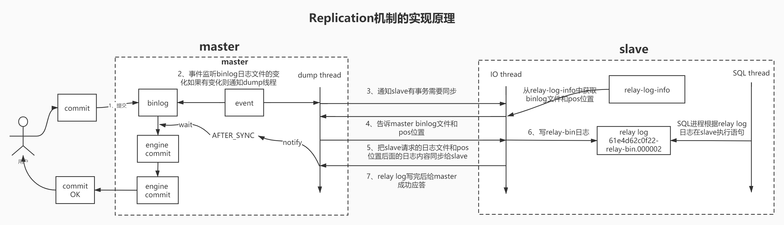
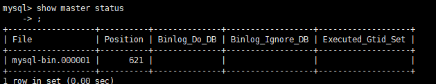
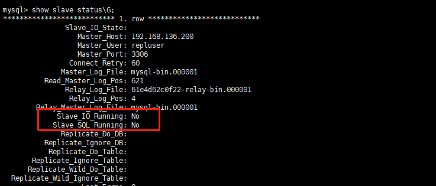
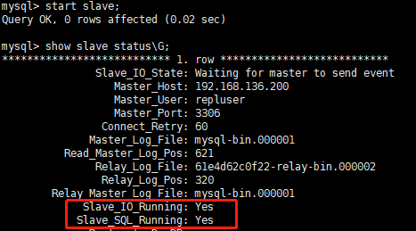
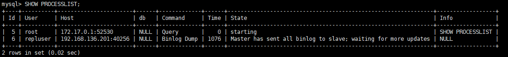
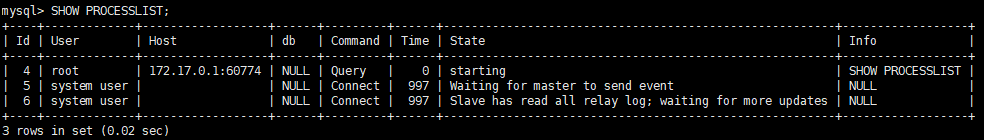
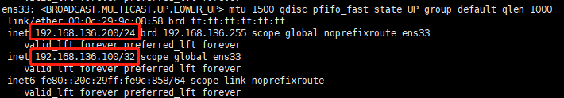
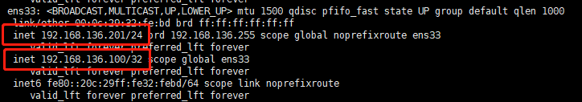

### MySQL进阶

Replication机制的实现原理




使用Docker安装MySQL

```shell
docker run --name mysql3306 -p 3306:3306 --privileged=true -ti -e MYSQL_ROOT_PASSWORD=root -e MYSQL_DATABASE=enjoy -e MYSQL_USER=user -e MYSQL_PASSWORD=pass -v /home/mysql/docker-data/3306/conf:/etc/mysql/conf.d -v /home/mysql/docker-data/3306/data/:/var/lib/mysql -v /home/mysql/docker-data/3306/logs/:/var/log/mysql -d mysql:5.7
```

MySQL主从复制

Master配置(主机：192.168.136.200)

在目录`/home/mysql/docker-data/3306/conf`下创建配置文件`my.cnf`

```properties
[mysqld]

character_set_server=utf8
init_connect='SET NAMES utf8'

lower_case_table_names=1
server-id=2003306
log-bin=mysql-bin
auto_increment_increment=2
auto_increment_offset=1

```

Slave配置(主机：192.168.136.201)

```properties
[mysqld]

character_set_server=utf8
init_connect='SET NAMES utf8'

lower_case_table_names=1
server-id=2013306
log-bin=mysql-bin
auto_increment_increment=2
auto_increment_offset=2
```

重启Master和Slave上的MySQL

```shell
docker restart mysql3306
```

在Master主机中添加权限

```shell
# 查看mysql3306的容器ID
docker ps 
# 进入容器
docker exec -it 容器ID /bin/bash
```

```mysql
# 登录mysql
mysql -uroot -proot -P 3306 -h 192.168.136.200
# 添加权限
GRANT REPLICATION SLAVE,FILE,REPLICATION CLIENT ON *.* TO 'repluser'@'%' IDENTIFIED BY '123456';
# 刷新权限
FLUSH PRIVILEGES;
```

在Master上查看master二进制文件

```mysql
show master status;
```



在Slave上配置master信息

```shell
# 登录mysql
mysql -uroot -proot -P 3306 -h 192.168.136.201
# 配置master信息
change master to master_host='192.168.136.200',master_port=3306,master_user='repluser',master_password='123456',master_log_file='mysql-bin.000001',master_log_pos=621;
```

查看Slave信息

```mysql
show slave status\G;
```



开启slave，启动SQL和IO线程

```mysql
start slave;
```



查看进程信息

```mysql
SHOW PROCESSLIST;
```

Master信息



Slave信息



然后在Master中对数据库进行操作，然后在Slave中就可以看到数据库同步了。


MySQL主主复制

按照主从复制的步骤搭建端口号为3307的服务

在master执行slave的操作，在slave执行master的操作，即可。


MySQL主从半同步复制

加载lib，所有主从节点都要配置

```mysql
-- 主库：
install plugin rpl_semi_sync_master soname 'semisync_master.so';
-- 从库：
install plugin rpl_semi_sync_slave soname 'semisync_slave.so';
```

查看是否安装成功

```mysql
show plugins;
```

启用半同步（先启用从库上的参数，最后启用主库的参数）

```mysql
-- 从库
set global rpl_semi_sync_slave_enabled = 1;
-- 主库
set global rpl_semi_sync_master_enabled = 1;
set global rpl_semi_sync_master_timeout = 10000;
```

在从库重新启动`io_thread`

```mysql
stop slave io_thread;
start slave io_thread;
```

查看主库状态信息

```mysql
show global status like "%sync%";
```

查询主库参数信息

```mysql
show global variables like '%sync%';
```

### MySQL高可用

使用keepalived实现VIP

keepalived yum安装

```shell
yum list installed|grep epel-release
```

查找可用安装的keepalived源

```shell
yum search keepalived
```

命令进行安装

```shell
yum install keepalived -y
```

启动keepalived服务

```shell
systemctl start keepalived
```

配置keepalived.conf

```shell
cd /etc	/keepalived
```

`keepalived.conf`

说明：192.168.136.200中配置如下：

192.168.136.201中配置，修改priority 130

```properties
! Configuration File for keepalived
#简单的头部，这里主要可以做邮件通知报警等的设置，此处就暂不配置了；
global_defs {
        #notificationd LVS_DEVEL
}
#预先定义一个脚本，方便后面调用，也可以定义多个，方便选择；
vrrp_script chk_haproxy {
    script "/etc/keepalived/chk.sh"  #具体脚本路径
    interval 2  #脚本循环运行间隔
}
#VRRP虚拟路由冗余协议配置
vrrp_instance VI_1 {   #VI_1 是自定义的名称；
    state MASTER    #MASTER表示是一台主设备，BACKUP表示为备用设备【我们这里因为设置为开启不抢占，所以都设置为备用】
    nopreempt      #开启不抢占
    interface ens33   #指定VIP需要绑定的物理网卡
    virtual_router_id 11   #VRID虚拟路由标识，也叫做分组名称，该组内的设备需要相同
    priority 131   #定义这台设备的优先级 1-254；开启了不抢占，所以此处优先级必须高于另一台

    advert_int 1   #生存检测时的组播信息发送间隔，组内一致
    authentication {    #设置验证信息，组内一致
        auth_type PASS   #有PASS 和 AH 两种，常用 PASS
        auth_pass asd    #密码
    }
    virtual_ipaddress {
        192.168.136.100    #指定VIP地址，组内一致，可以设置多个IP
    }
    track_script {    #使用在这个域中使用预先定义的脚本，上面定义的
        chk_haproxy   
    }

    #notify_backup "/etc/init.d/haproxy restart"   #表示当切换到backup状态时,要执行的脚本
    #notify_fault "/etc/init.d/haproxy stop"     #故障时执行的脚本
}
```

新增检查mysql的docker容器是否存活脚本chk.sh

```shell
mysql -h 192.168.136.200 -u root -proot -P 3307 -e "show status;" > /dev/null 2>&1
if [ $? == 0 ]
then
  echo "$host mysql login successfully"
  exit 0
else
  echo " mysql login faild"
  killall keepalived
  exit 2
fi
```

安装ipvsadm

```shell
yum install ipvsadm -y
```

要想在宿主机使用mysql命令，需要安装mysql客户端

```shell
# 下载MySQL源安装包
wget http://dev.mysql.com/get/mysql57-community-release-el7-8.noarch.rpm
# yum安装mysql源
yum localinstall mysql57-community-release-el7-8.noarch.rpm -y
# 检查mysql源是否安装成功
yum repolist enabled | grep "mysql.*-community.*"
# yum安装MySQL
yum install mysql-community-server -y
# 启动MySQL
systemctl start mysqld
# 添加开机启动
systemctl enable mysqld 
systemctl daemon-reload
# 查看MySQL状态
systemctl status mysqld
# 查看默认密码
vi /var/log/mysqld.log
# A temporary password is generated for root@localhost: td.d=o&#l61C
# 登录MySQL
mysql -uroot -p 
```

```mysql
# 修改默认密码
set password for 'root'@'localhost'=password('Root@123456');
# 添加远程登录的用户权限
GRANT ALL PRIVILEGES ON *.* TO 'root'@'%' IDENTIFIED BY 'Root@123456' WITH GRANT OPTION;
FLUSH PRIVILEGES;
# 查看MySQL字符集
show variables like '%character%';
```

```shell
# 修改字符集
vi /etc/my.cnf
# 添加
# character_set_server=utf8
# init_connect='SET NAMES utf8'
# 重启MySQL
systemctl stop mysqld
systemctl start mysqld
```

分别在192.168.136.200和192.168.136.201两台主机中启动keepalived，此时查看ip信息

```shell
ip a
```

192.168.136.200



当关闭200机器的keepalived，则201机器漂移到100

192.168.136.201

